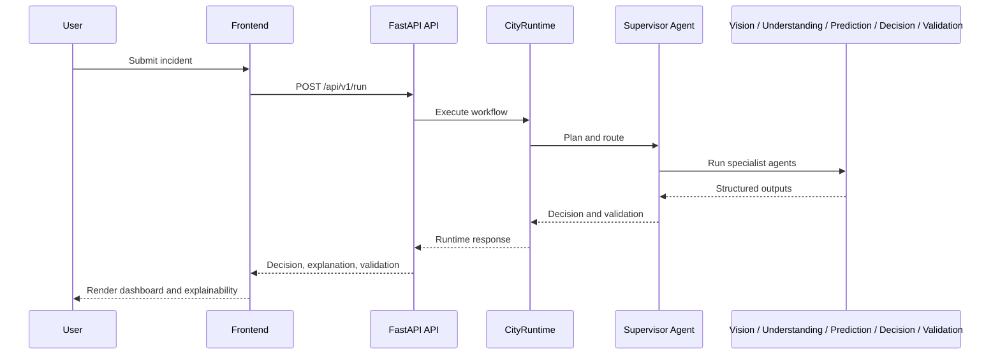

# Architecture

## Overview

CityBrain AI follows the existing shared-state architecture. Incident intake flows through a FastAPI runtime that invokes a supervisor-led workflow of specialist agents. The runtime emits structured traces and a decision payload for the frontend.

## Runtime flow

## Components

- Frontend: Next.js and Tailwind-based operator experience
- Backend: FastAPI application with middleware, metrics, security headers, and runtime orchestration
- Agents: Specialist modules working over shared IncidentState
- Configuration: Environment-driven settings for Gemini, Firebase, Maps, and security
