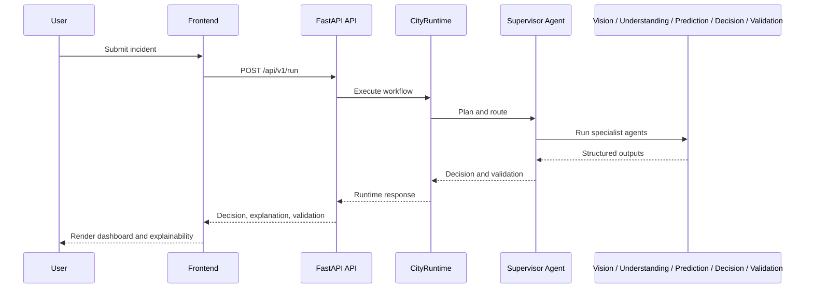

# 🏗️ CityBrain AI — Architecture

  

## Overview

CityBrain AI follows a **shared-state architecture**. Incident intake flows through a FastAPI runtime that invokes a supervisor-led workflow of specialist agents. The runtime emits structured traces and a decision payload consumed by the frontend.

---

## Runtime Flow

---

## Components

| Layer | Description |
|---|---|
| **Frontend** | Next.js and Tailwind-based operator experience |
| **Backend** | FastAPI application with middleware, metrics, security headers, and runtime orchestration |
| **Agents** | Specialist modules working over shared `IncidentState` |
| **Configuration** | Environment-driven settings for Gemini, Firebase, Maps, and security |
