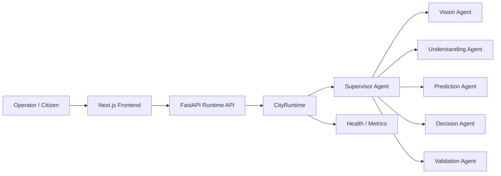

# 🏙️ CityBrain AI

**AI-Powered Civic Operations Platform**

*Shared incident state · Multi-agent reasoning · Explainable AI · Human-in-the-loop oversight*

    

[Overview](#overview) · [Key Capabilities](#key-capabilities) · [Architecture](#system-architecture) · [Docs](#documentation)

---

**CityBrain AI** is an AI-powered civic operations platform that combines shared incident state, multi-agent reasoning, explainable AI, and a modern operator experience to support incident intake, triage, prediction, decision support, and operational oversight.

The platform is designed for public-sector and enterprise teams that need:

- ⚡ Faster situational awareness
- 🧩 Structured incident processing
- 🤖 AI-assisted operational decision-making
- 🔍 Transparent and explainable AI workflows
- 🧑‍⚖️ Human oversight for sensitive decisions

---

## Overview

CityBrain AI enables operators to capture civic incidents, process them through an AI-assisted workflow, and review structured recommendations with explainability.

The platform follows a **supervisor-led multi-agent architecture**, where specialized agents collaborate to analyze incidents across multiple stages:

| Stage | Agent | Function |
|---|---|---|
| 1 | **Vision** | Extracts relevant information from visual inputs |
| 2 | **Understanding** | Interprets the incident context and identifies key details |
| 3 | **Prediction** | Estimates potential outcomes, risks, and future developments |
| 4 | **Decision** | Generates structured recommendations and possible actions |
| 5 | **Validation** | Reviews outputs for consistency, safety, and reliability |

The result is a structured decision-support workflow that combines AI automation with human oversight.

---

## Key Capabilities

### 📥 Incident Intake
Capture and process structured civic reports, including incident details, descriptions, location information, and supporting evidence.

### 🤝 Multi-Agent Analysis
Coordinate specialized AI agents for:
- Visual analysis
- Incident understanding
- Risk and outcome prediction
- Decision support
- Output validation

### 🔍 Explainable AI
Expose reasoning traces and structured agent outputs so operators can understand how recommendations were generated.

### 📊 Operational Dashboard
Provide interfaces for:
- Incident monitoring
- Analytics
- Workflow tracking
- Operational oversight
- Administrative management

### ☁️ AI and Cloud Integrations
Support configurable integrations with:
- Google Gemini
- Firebase Authentication
- Firestore-compatible services
- Google Maps and location services

### 🧑‍⚖️ Human-in-the-Loop Decision Support
The platform is designed to assist human operators rather than replace human judgment. Sensitive decisions can be reviewed and validated before action.

---

## System Architecture

CityBrain AI follows a frontend-to-backend workflow built around a shared incident state and a supervisor-led multi-agent pipeline.

For a deeper breakdown of the runtime flow and components, see [`Architecture.md`](Architecture.md).

---

## Documentation

| Document | Description |
|---|---|
| [`Architecture.md`](Architecture.md) | Shared-state architecture and runtime flow |
| [`API_Reference.md`](API_Reference.md) | Runtime and health API endpoints |
| [`DEPLOYMENT.md`](DEPLOYMENT.md) | Local, Docker, and Google Cloud Run deployment |
| [`CONTRIBUTING.md`](CONTRIBUTING.md) | Contribution workflow and PR requirements |

---

*CityBrain AI — AI automation with human oversight, built for civic operations.*

