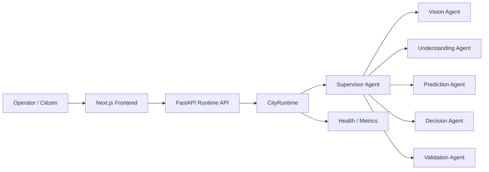

# CityBrain AI

CityBrain AI is a civic operations platform that combines a shared incident state, multi-agent reasoning, and a polished operator experience for incident intake, triage, explainability, and decision support. It is designed for public-sector and enterprise teams that need faster situational awareness and more transparent AI-assisted workflows.

## Overview

CityBrain AI helps operators capture incidents, route them through an AI-assisted workflow, and review structured recommendations with explainability. The platform supports incident intake, prioritization, prediction, decision support, and explainability traces for operational review.

## Key capabilities

- Incident intake and structured civic report handling
- Multi-agent analysis across vision, understanding, prediction, decision, and validation stages
- Explainability and reasoning traces for operator review
- Dashboard, analytics, workflow, and admin-oriented interfaces
- Configurable backend integration for Gemini, Firebase, and maps services

## System architecture

The runtime is organized as a frontend-to-backend workflow with a shared incident state and a supervisor-led multi-agent pipeline:



## Technology stack

- Frontend: Next.js, React, Tailwind CSS
- Backend: FastAPI, Pydantic, Uvicorn
- AI/ML: Google Gemini integration with a multi-agent workflow
- Storage/Auth: Firebase Authentication and Firestore-compatible services
- Deployment: Docker Compose, Dockerfiles, and Cloud-ready configuration

## Documentation

- [API.md](API.md) for runtime endpoints and example payloads
- [ARCHITECTURE.md](ARCHITECTURE.md) for the shared-state agent architecture
- [DEPLOYMENT.md](DEPLOYMENT.md) for local, Docker, and cloud deployment steps
- [CONTRIBUTING.md](CONTRIBUTING.md) for contribution expectations and validation steps

## Demo and judging notes

A short demo flow for the project:

1. Open the dashboard and show the incident intake experience.
2. Submit a new incident via the report page.
3. Highlight the workflow steps and explainability trace.
4. Show the decision summary and validation outcome.
5. Open the admin view to demonstrate oversight and monitoring.

Helpful judging points:

- The runtime is structured around a modular, agent-driven orchestration pattern that is extensible for future AI workflow integration.
- The platform uses structured outputs, validation, deterministic fallbacks, and human review paths to reduce hallucination risk.
- Explainability is surfaced directly in the UI through agent reasoning and decision traces.

## Project structure

```text
CityBrainAI/
├── backend/
│   └── app/
├── frontend/
│   ├── app/
│   ├── components/
│   ├── services/
│   └── contexts/
├── docs/
├── docker-compose.yml
└── README.md
```

## Getting started

### Prerequisites

- Python 3.11+
- Node.js 20+
- Firebase project with Authentication, Firestore, and Storage enabled
- Gemini API key for live AI responses

### Backend

```bash
cd backend
python -m venv .venv
.venv\Scripts\activate
pip install -r requirements.txt
python -m uvicorn app.main:app --reload --port 8000
```

The backend API will be available at http://127.0.0.1:8000 and the interactive docs at http://127.0.0.1:8000/docs.

### Frontend

```bash
cd frontend
npm install
npm run dev
```

The frontend will be available at http://localhost:3000.

## Environment configuration

Copy [.env.example](.env.example) to .env and provide the required values for your environment.

The backend reads configuration from environment variables and supports the existing CityBrain settings model. Keep secrets server-side and do not commit real keys or credentials.

Example variables include:

- GEMINI_API_KEY
- CITYBRAIN_GEMINI__API_KEY
- CITYBRAIN_FIREBASE__PROJECT_ID
- CITYBRAIN_GOOGLE_MAPS__API_KEY

## Testing

```bash
cd backend
.venv\Scripts\python.exe -m pytest -q

cd ../frontend
npm.cmd run lint
npm.cmd run typecheck
npm.cmd run build
```

## Security

- Keep secrets in environment variables or a secret manager rather than in source code.
- Do not commit API keys, Firebase credentials, or private configuration values.
- Keep Gemini and other backend secrets server-side.
- Follow least-privilege access for AI agent tools and require validation for sensitive actions.

## Deployment

Build and run the application with Docker Compose:

```bash
docker compose up --build
```

For cloud deployment, use the existing Dockerfiles and environment configuration with your platform’s secret manager or environment injection mechanism.
