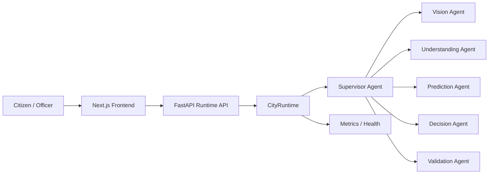

# CityBrain AI

CityBrain AI is a production-minded civic operations platform that combines a shared incident state, multi-agent reasoning, and a polished operator experience for incident intake, triage, explainability, and decision support.

## Highlights

- Shared incident state for vision, understanding, prediction, decision, and validation agents
- FastAPI backend with structured logging, metrics, security headers, and health endpoints
- Next.js frontend experience for dashboarding, reporting, explainability, and admin views
- Deployment assets for Docker, Cloud Run, and GitHub Actions

## Architecture



## Local development

### Prerequisites

- Python 3.11+
- Node.js 20+
- Firebase project with Authentication, Firestore, and Storage enabled
- Gemini API key if you want live AI responses

### Backend

```bash
cd backend
python -m venv .venv
.venv\Scripts\activate
pip install -r requirements.txt
uvicorn app.main:app --reload --port 8000
```

### Frontend

```bash
cd frontend
npm install
npm run dev
```

## Testing

```bash
cd backend
.venv\Scripts\python.exe -m pytest app/tests -q
cd ../frontend
npm install
npm run lint
npm run typecheck
npm run build
```

## Deployment

- Copy [.env.example](.env.example) to .env and set your values.
- Frontend variables should be exposed to the Next.js app as `NEXT_PUBLIC_*` values.
- Backend variables should be provided through the environment expected by the FastAPI settings layer.
- Build services with Docker Compose:

```bash
docker compose up --build
```

## Google Cloud notes

- Vertex AI / Gemini can be enabled through environment variables.
- Cloud Storage and Google Maps integration are prepared through configuration settings.
- Cloud Run deployment can use the provided Dockerfiles and service account credentials.
