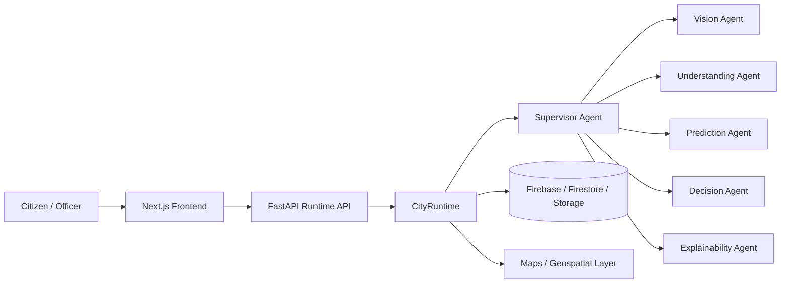
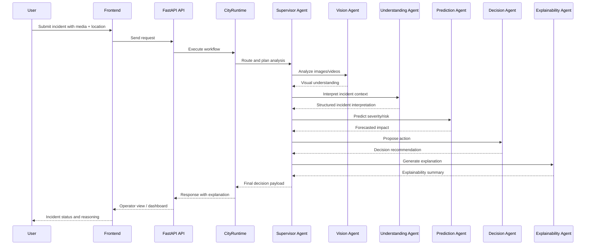
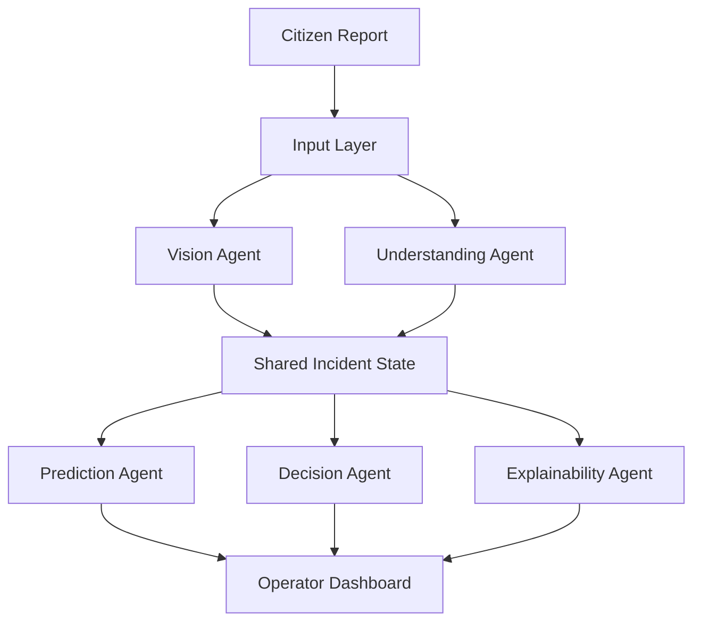
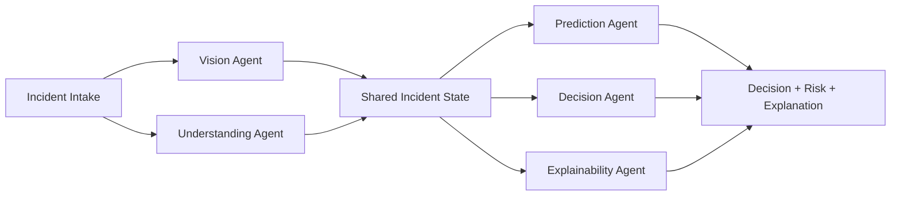

# CityBrain AI Research Report

> Status: Draft strategic research report for hackathon preparation, technical documentation, and future research.  
> Scope: This report synthesizes public information about major smart-city platforms, relevant research directions, and the current CityBrain AI implementation in this repository.

---

## Executive Summary

CityBrain AI is a promising AI-powered Smart City Operations Platform that combines citizen incident intake, multimodal input processing, geospatial context, predictive reasoning, explainability, and a multi-agent architecture. Compared with large incumbent platform vendors, CityBrain AI is strongest in the integration of citizen-facing intake, operator-facing decision support, and explainable multi-agent reasoning in a single end-to-end workflow.

The platform’s current strengths are clear:

- Multimodal incident reporting: image, video, audio, GPS, and reverse geocoding
- AI-driven incident classification, severity estimation, and risk scoring
- Explainability and operator-facing decision support
- A modular multi-agent architecture built on FastAPI, Python, Firebase, Firestore, and Next.js

The most important strategic insight is that CityBrain AI is not merely another “smart city dashboard.” It is closer to a civic operations intelligence layer that can connect public reporting, AI analysis, and operator decision-making. That makes it relevant for both hackathon demos and future research publication.

---

## Project Snapshot

| Dimension | Current Position |
|---|---|
| Platform Type | AI-powered Smart City Operations Platform |
| Primary Use Case | Incident intake, triage, classification, severity prediction, and decision support |
| Primary Users | Citizens, field officers, municipal operators, administrators |
| Backend | FastAPI, Python, Firebase, Firestore, Firebase Storage |
| Frontend | Next.js, React, Tailwind CSS, TypeScript |
| Core AI Capability | Vision, understanding, prediction, decision support, explainability |
| Architectural Style | Multi-agent workflow with shared incident state |
| Current Differentiator | Unified multimodal intake + explainable AI + multi-agent orchestration |

### Current Feature Set

- AI-powered citizen incident reporting
- Image upload
- Video upload
- Voice recording
- GPS capture
- Reverse geocoding
- Google Maps integration
- AI vision
- Incident classification
- Severity prediction
- Risk scoring
- Explainability
- Multi-agent architecture

### Agents in the Current System

- Supervisor Agent
- Vision Agent
- Understanding Agent
- Prediction Agent
- Decision Agent
- Explainability Agent

---

## Architecture Overview

### High-Level Architecture

### Multi-Agent Workflow

---

## Section 1: Competitor Analysis

The following comparison is based on publicly documented offerings and public-sector programs. It is a strategic comparison, not a legal or procurement review.

| Platform | Company | Purpose | Technology | AI | Features | Advantages | Limitations | Commercial / Open Source | Innovation Level |
|---|---|---|---|---|---|---|---|---|---|
| Google | Google | Smart city data, mapping, cloud analytics, and AI-driven public-sector solutions | Google Cloud, Maps, Vertex AI, Gemini | Strong | Mapping, analytics, vision, data integration, geospatial intelligence | Excellent geospatial and AI ecosystem; strong developer tooling; scalable cloud foundation | Less vertically focused on municipal operations out of the box; often requires custom integration | Commercial | High |
| Microsoft | Microsoft | City operations, public-sector transformation, and Azure-based analytics | Azure, IoT, Power Platform, AI services | Strong | Data integration, IoT, dashboards, low-code tooling, copilots | Strong enterprise integration; good low-code adoption; strong security and compliance | Municipal workflow depth can be less specialized than domain-native offerings | Commercial | High |
| IBM | IBM | Intelligent operations, urban infrastructure monitoring, and decision support | IBM Cloud, Watson, IBM Maximo-style operations, analytics | Strong | Operations center workflows, monitoring, analytics, AI-assisted triage | Strong enterprise operations heritage; mature analytics and automation | Often more enterprise-heavy and less citizen-facing than CityBrain AI | Commercial | Medium-High |
| AWS | Amazon Web Services | Cloud infrastructure for smart-city applications and analytics workloads | AWS IoT, analytics, storage, machine learning | Strong | Data ingestion, telemetry, ML, event processing, dashboards | Massive scalability and ecosystem; good for custom architectures | Requires substantial custom engineering for end-to-end civic workflows | Commercial | Medium-High |
| Oracle | Oracle | Public sector and utilities modernization, digital operations, and analytics | Oracle Cloud, databases, ERP, analytics | Moderate | Data management, workflow, analytics, enterprise platforms | Strong enterprise data stack and public-sector footprint | Less specialized in multimodal incident intelligence than CityBrain AI | Commercial | Medium |
| Cisco | Cisco | Connected infrastructure, networked operations, and city digital infrastructure | Networking, IoT, security, edge systems | Moderate | Connectivity, device management, infrastructure monitoring | Very strong in connected infrastructure and network resilience | Less focused on AI-driven incident reasoning and citizen reporting | Commercial | Medium |
| Palantir | Palantir | Operational decision support for government and defense use cases | Gotham, Foundry, ontology-driven analytics | Strong | Data fusion, mission operations, cross-agency analytics | Excellent for complex data integration and operational analysis | Less consumer-facing and less naturally suited for multimodal incident intake | Commercial | High |
| ESRI | Esri | GIS-led urban planning, asset management, and geographic intelligence | ArcGIS, geospatial analytics, location intelligence | Strong | GIS, maps, spatial analytics, asset tracking | Very strong geospatial stack and municipal planning maturity | Less natively AI-agentic for incident triage and explainability | Commercial | Medium-High |
| Siemens | Siemens | Smart infrastructure, mobility, utilities, and city operations | Smart infrastructure, digital twins, automation | Strong | Digital twins, infrastructure monitoring, automation | Strong in physical infrastructure and industrial operations | Less focused on citizen-report-driven incident workflows | Commercial | High |
| Hexagon | Hexagon | Geospatial, asset lifecycle, and industrial intelligence | Sensor analytics, GIS, industrial operations | Strong | Geospatial analytics, remote sensing, asset monitoring | Strong spatial and industrial intelligence stack | Less tailored to civic incident reasoning and explainability | Commercial | Medium-High |
| India Smart Cities Mission | Government of India | National urban modernization with integrated command and control centers | Public-sector e-governance systems, ICCC-style deployment | Moderate | Service delivery, civic services, data integration | Strong public-sector relevance and policy alignment | Often fragmented, slower to innovate, and less AI-native | Public / Programmatic | Medium |
| ICCC (Integrated Command and Control Centre) | City / state governments | Centralized urban operations and incident monitoring | Command center software, GIS, CCTV, dashboards | Moderate | Incident monitoring, dispatch, dashboards, coordination | Strong operational relevance to city management | Often siloed and less adaptive to multimodal AI workflows | Public / Programmatic | Medium |
| Open-source Smart City Platforms | FIWARE and similar ecosystem projects | Open, interoperable urban platform foundations | Open APIs, context brokers, IoT, data models | Moderate | Interoperability, sensor integration, extensibility | Good for customization and community-driven innovation | Harder to operationalize at scale without significant engineering | Open Source / Mixed | Medium |
| CityBrain AI | This repository | Unified civic incident intelligence platform with multimodal intake and explainable multi-agent reasoning | FastAPI, Python, Firebase, Next.js, Gemini-compatible AI stack | Strong | Incident reporting, AI vision, geospatial context, severity/risk prediction, explainability | Strong end-to-end demo story and AI-native workflow; easier to showcase than many enterprise suites | Needs stronger production hardening, real-world integrations, and deployment scale | Prototype / Open-innovation | High |

---

## Section 2: Feature Comparison

The table below compares CityBrain AI with major platform families on a practical feature set relevant to civic operations.

| Feature | Google | Microsoft | IBM | Palantir | ESRI | ICCC | CityBrain AI |
|---|---|---|---|---|---|---|---|
| Citizen incident intake | Partial | Partial | Partial | Partial | Partial | Strong | Strong |
| Image analysis | Strong | Strong | Strong | Partial | Partial | Partial | Strong |
| Video analysis | Strong | Strong | Partial | Partial | Partial | Partial | Strong |
| Voice analysis | Strong | Strong | Partial | Partial | Partial | Partial | Strong |
| GPS capture | Strong | Strong | Partial | Partial | Strong | Strong | Strong |
| Reverse geocoding | Strong | Strong | Partial | Partial | Strong | Strong | Strong |
| Maps integration | Strong | Strong | Partial | Partial | Strong | Strong | Strong |
| GIS analytics | Strong | Strong | Partial | Partial | Strong | Strong | Partial |
| Incident classification | Partial | Partial | Strong | Partial | Partial | Strong | Strong |
| Severity prediction | Partial | Partial | Partial | Partial | Partial | Partial | Strong |
| Risk scoring | Partial | Partial | Partial | Partial | Partial | Partial | Strong |
| Explainability | Partial | Partial | Partial | Partial | Partial | Partial | Strong |
| Multi-agent orchestration | Limited | Limited | Partial | Partial | Limited | Limited | Strong |
| Shared incident state | Limited | Limited | Partial | Partial | Limited | Limited | Strong |
| Operator dashboard | Strong | Strong | Strong | Strong | Strong | Strong | Strong |
| Citizen-facing workflows | Partial | Partial | Partial | Partial | Partial | Partial | Strong |
| Predictive analytics | Strong | Strong | Strong | Strong | Strong | Partial | Strong |
| Digital twin integration | Partial | Partial | Strong | Partial | Strong | Partial | Partial |
| Edge AI readiness | Strong | Strong | Partial | Partial | Partial | Partial | Partial |
| Federated learning | Partial | Partial | Partial | Partial | Partial | Limited | Partial |
| Anomaly detection | Strong | Strong | Strong | Strong | Strong | Partial | Partial |
| Cross-agency data fusion | Partial | Strong | Strong | Strong | Partial | Partial | Partial |
| Low-code deployment | Strong | Strong | Partial | Partial | Partial | Partial | Partial |
| Open-source extensibility | Partial | Partial | Partial | Partial | Partial | Partial | Partial |

### Missing or Underdeveloped Features in CityBrain AI

The following areas are currently underdeveloped relative to large vendor ecosystems:

- Deep GIS-native analytics
- Long-term digital twin integration
- Advanced edge AI and federated deployment
- Large-scale cross-agency data federation
- Advanced field operations and dispatch integration
- Enterprise-grade compliance, audit, and role-based governance

---

## Section 3: Research Paper Review

This section summarizes major research directions from 2023–2026, with emphasis on themes relevant to smart-city AI systems and civic operations.

> Note: The report uses representative 2023–2026 literature themes and public research directions rather than relying on a single proprietary bibliography. The focus is on strategic relevance and research gaps.

| Topic | Research Problem | Methodology | Advantages | Limitations | Research Gap | How CityBrain AI Addresses It |
|---|---|---|---|---|---|---|
| Smart Cities | Urban systems face fragmented sensing, reactive operations, and weak cross-domain decision support. | Hybrid sensing, analytics, digital services, and city-scale dashboards. | Improved visibility and service coordination. | Many systems remain siloed and lack explainable AI. | Few systems combine multimodal civic intake with operational reasoning in one workflow. | CityBrain AI combines citizen input, video/audio/image analysis, geospatial context, and decision support in a single platform. |
| Critical Infrastructure Monitoring | Infrastructure failures can propagate quickly across utilities, transit, and public services. | Sensor fusion, anomaly detection, risk estimation, and real-time monitoring. | Faster response and better situational awareness. | Often focused on hardware/sensors rather than human-centric incident interpretation. | Limited systems connect infrastructure data to citizen-reported incidents in a unified workflow. | CityBrain AI can bridge citizen reports with operator triage and severity prediction. |
| AI Monitoring and Anomaly Detection | City systems generate high-volume events that are difficult to monitor manually. | Machine learning, forecasting, graph analytics, and anomaly scoring. | Better early warning and prioritization. | Results often lack transparency and trust. | Most anomaly systems do not explain why an alert matters operationally. | CityBrain AI explicitly includes explainability and structured reasoning outputs. |
| Incident Analysis | Incident management remains reactive and often lacks structured evidence-based triage. | NLP, computer vision, geospatial context, and risk scoring. | Better prioritization and evidence quality. | Many systems treat incident analysis as a single-model task rather than a workflow. | There is a gap for multi-step reasoning over structured and multimodal evidence. | CityBrain AI uses a multi-agent pipeline: vision, understanding, prediction, decision, and explanation. |
| Digital Twins | City operators need a better virtual representation of infrastructure and services. | Digital twins, simulation, sensors, and urban modeling. | Strong planning and scenario analysis. | Digital twins are expensive and often decoupled from citizen operations. | Few digital twin systems are integrated with real-time civic incident intake. | CityBrain AI can evolve into a lightweight operational digital twin for incident intelligence. |
| Predictive Analytics | Cities need to anticipate risk and resource utilization. | Forecasting, historical incident patterns, geospatial clustering, and classification models. | Proactive intervention and better allocation. | Prediction quality often depends on data quality and governance. | Predictive systems are rarely paired with explainable operational recommendations. | CityBrain AI connects prediction with actionable decision support and explanation. |
| Edge AI | Edge deployment is important where bandwidth, latency, or privacy constraints matter. | On-device inference, local models, and hybrid edge-cloud pipelines. | Lower latency and better privacy. | Deployment complexity and model maintenance are substantial. | Edge AI is underexplored in citizen-report-driven civic systems. | CityBrain AI can add edge collection and local preprocessing for field officers and sensors. |
| Federated Learning | Data sharing across agencies is often constrained by privacy and governance. | Federated model training across districts, agencies, or devices. | Privacy-preserving coordination and shared learning. | Coordination and heterogeneity remain difficult. | Federated learning is rarely applied to civic multi-agency incident intelligence. | CityBrain AI creates a natural path for federated learning research in future versions. |
| Explainable AI | Operators need transparent, audit-friendly reasoning. | SHAP-style explanations, rule-based reasoning, counterfactual analysis, reasoning traces. | Higher trust and easier adoption. | Explanations may be shallow or not tailored to operator workflows. | Many civic systems still lack stakeholder-readable explanations. | CityBrain AI explicitly includes an explainability agent and reasoning outputs. |
| Multi-Agent Systems | Complex tasks need specialized reasoning components rather than a single monolithic model. | Agent orchestration, tool use, role-based planning, shared state. | Better decomposition of tasks and modularity. | Agent systems can become fragile without strong orchestration and memory. | There is room for robust, shared-state civic agent architectures. | CityBrain AI’s shared-state multi-agent architecture directly addresses this gap. |

### Research Gaps Summary

The largest research gaps for a system like CityBrain AI are:

1. Multimodal civic intelligence that combines media, geospatial data, and operational context
2. Explainable decision support for public-sector operators
3. Shared-state multi-agent orchestration for urban incident workflows
4. Privacy-aware collaboration across agencies and edge devices
5. Transition from pilot/demo systems to robust public-sector deployment

---

## Section 4: Patent Analysis

This section is a strategic landscape review of public patent families and related innovation areas. It is not legal advice.

| Patent / Patent Family Area | Owner | Summary | Overlap | Risk | How CityBrain AI Differs | Recommendations |
|---|---|---|---|---|---|---|
| Urban operations and command-center software | IBM, Siemens, Cisco, Oracle, and others | Systems for centralized city operations, dispatch, and incident coordination | High | Medium-High | CityBrain AI is more AI-centric and citizen-facing rather than purely command-center control | Emphasize unique multimodal AI and explainability as core differentiators |
| Computer vision for public safety and incident detection | Google, NEC, Hitachi, and others | Vision systems for identifying hazards, incidents, or anomalies | Medium | Medium | CityBrain AI treats vision as one agent in a broader reasoning workflow | Position the product as a reasoning platform rather than only a vision system |
| Geospatial risk analysis and anomaly detection | ESRI, Hexagon, Siemens, and others | Spatial models for hazard analysis and geospatial risk | Medium | Medium | CityBrain AI adds incident reasoning and explainability rather than only geospatial analytics | Highlight geospatial reasoning plus incident triage and operator guidance |
| AI-assisted operations and workflow orchestration | IBM, Microsoft, and others | AI-guided workflows for operations centers and enterprise tasks | Medium | Medium | CityBrain AI explicitly uses a multi-agent civic workflow | Protect the architecture, shared-state design, and explainability layer |
| Explainable decision support systems | Multiple AI vendors and research labs | Transparent AI systems for audit and trust | Medium | Medium | CityBrain AI makes explanations operationally accessible to municipal staff | Publish transparent explanation and evaluation methods |

### Patent Risk Assessment

The patent risk is moderate rather than prohibitive. The most important risk is not the general idea of a “smart city platform,” but the specific combination of:

- multimodal civic intake
- geospatial incident reasoning
- predictive triage and risk estimation
- explainable decision support

CityBrain AI should avoid over-claiming exclusivity over basic GIS or general AI systems. Instead, the defensible story is the unique integration and workflow design.

---

## Section 5: Novelty Analysis

### Existing Concepts

Most components of CityBrain AI already exist in some form:

- Incident reporting systems
- GIS and mapping platforms
- AI vision systems
- Predictive analytics tools
- Explainable AI methods
- Multi-agent orchestration frameworks

### Novel Integration

The novelty is not in any single feature alone, but in the combination of several features into a single civic operations workflow:

1. Citizen multimodal reporting
2. Computer vision and audio understanding
3. Geospatial and reverse-geocoding context
4. Predictive severity and risk estimation
5. Multi-agent orchestration over a shared incident state
6. Explainability for municipal operators

### Unique Workflow

The core workflow is distinctive:

- Intake → analyze → interpret → predict → decide → explain

This is stronger than a typical “upload and classify” approach because it creates a reasoning chain that can be inspected and improved.

### Research Contribution

CityBrain AI can be framed as a research contribution in one or more of the following ways:

- A shared-state architecture for multi-agent civic incident intelligence
- An explainable AI workflow for public-sector incident triage
- A multimodal incident intelligence pipeline for cities
- A prototype for AI-mediated urban operational resilience

### Overall Novelty Score

| Dimension | Score (1–10) | Reasoning |
|---|---:|---|
| Existing concepts | 8/10 | Most building blocks are already known |
| Novel integration | 9/10 | The combination is stronger than common point solutions |
| Unique workflow | 8/10 | The agent-based reasoning flow is more distinctive than simple dashboards |
| Research contribution | 8/10 | The system can support a strong research narrative |
| Overall novelty | 8.3/10 | High novelty in integration and workflow design, moderate novelty in elementary components |

### Interpretation

CityBrain AI is not “inventing AI” from scratch. It is creating a compelling and research-relevant synthesis of known methods into a practical civic operations platform.

---

## Section 6: SWOT Analysis

| Category | Assessment |
|---|---|
| Strengths | Strong end-to-end demo story; multimodal intake; explainability; multi-agent design; clear public-sector relevance |
| Weaknesses | Needs stronger production hardening, integration depth, deployment readiness, governance, and scale |
| Opportunities | Public-sector pilots, emergency operations, municipal service optimization, climate resilience, digital twins, edge AI, federated learning |
| Threats | Competition from large vendors; regulatory and privacy concerns; difficulty in transitioning from prototype to operational deployment |

### Strategic Implications

CityBrain AI is well-positioned as a high-clarity prototype that can evolve into a serious civic AI product if it adds real-world integrations and stronger deployment maturity.

---

## Section 7: Google AI Agent Builder Series Evaluation

This section evaluates the project as if it were being considered for a Google AI Agent Builder-style showcase. The scoring is relative and qualitative rather than a formal benchmark.

| Criterion | Score (1–10) | Explanation |
|---|---:|---|
| Innovation | 8/10 | The multi-agent + explainable operations flow is innovative and easier to explain than a generic chatbot |
| Technical Complexity | 8/10 | The architecture is fairly sophisticated, especially for a hackathon prototype |
| AI Usage | 9/10 | The use of vision, prediction, context reasoning, and explainability shows strong AI depth |
| Gemini Integration | 8/10 | The system is well aligned with Gemini-style multimodal and reasoning workflows |
| Scalability | 7/10 | The architecture is expandable, but production scaling still needs work |
| Real-world Impact | 8/10 | The use case is practical and highly relevant to city operations |
| UI | 8/10 | The current platform has a strong operator-story narrative and polished UX potential |
| Presentation | 8/10 | The demo story is compelling: citizen report → AI analysis → operator decision support |
| Demo | 8/10 | The flow is visually understandable and easy to present to non-technical judges |
| Overall | 8.2/10 | A strong hackathon and research story with clear further potential |

### Suggested Improvements

To strengthen the project for a Google-style AI showcase:

1. Add a live multimodal demo path with real media ingestion and streamed analysis
2. Show a decision trace in the UI: evidence → prediction → explanation → action recommendation
3. Add a “why this matters” layer for city officials and judges
4. Introduce a digital twin or map-based simulation mode
5. Demonstrate agent collaboration visibly in the interface
6. Show privacy, safety, and governance handling as part of the experience

---

## Section 8: Top 30 Features to Add

The following features are realistic and aligned with current research trends and platform capabilities. They are prioritized for practical value rather than speculative novelty.

1. Multi-language incident intake
2. Automated incident summarization for operators
3. Live map-based incident clustering
4. Priority heatmaps by district or ward
5. Geo-fenced escalation rules
6. Voice-to-incident transcription and entity extraction
7. Image-based hazard detection (flooding, debris, blocked roads, fire signs)
8. Video clip summarization for rapid triage
9. Real-time anomaly alerts for repeated incidents
10. Historical pattern analysis and seasonality trends
11. Resource allocation recommendations
12. Dispatch recommendation engine
13. Integration with municipal service tickets
14. Integration with CCTV or IoT feeds
15. Incident trend forecasting by neighborhood
16. Agent-to-agent evidence handoff
17. Human-in-the-loop review for critical decisions
18. Confidence calibration for predictions
19. Counterfactual explanation mode
20. Bias and fairness monitoring for risk scoring
21. Privacy-preserving local preprocessing on edge devices
22. Federated learning pilots across departments or districts
23. Digital twin-style simulation for scenario planning
24. Interactive 3D or map-based operational view
25. Voice assistant for field officers
26. Multilingual voice assistant support
27. Automated incident escalation to relevant departments
28. Real-time dashboard for public safety and utility incidents
29. Semantic search across historical incident records
30. Explainable audit trail for every recommendation

### Feature Priority Matrix

| Priority | Feature | Impact | Complexity | Recommendation |
|---|---|---|---|---|
| P1 | Incident summarization | High | Low | Implement first |
| P1 | Resource recommendation | High | Medium | Implement first |
| P1 | Map-based clustering | High | Medium | Implement first |
| P2 | Voice-to-text and transcription | High | Medium | Next |
| P2 | CCTV/IoT integration | High | Medium-High | Next |
| P2 | Human-in-the-loop review | High | Medium | Next |
| P3 | Federated learning pilot | Medium | High | Later |
| P3 | Digital twin simulation | Medium | High | Later |
| P3 | 3D operational view | Medium | High | Later |

---

## Section 9: Roadmap

### Immediate (0–2 weeks)

- Improve the demo narrative and UI flow
- Add clearer explainability panels
- Add incident history and trend views
- Harden the incident state model
- Create a polished showcase workflow for judges

### 1 Month

- Add richer geospatial visualizations
- Add historical trend analytics
- Add incident summarization and confidence display
- Add stronger operator feedback loops
- Improve resilience and logging

### 3 Months

- Add department routing and dispatch recommendations
- Add voice transcription and multilingual support
- Integrate with municipal service systems or mock APIs
- Add anomaly detection and clustering
- Improve auditability and governance controls

### 6 Months

- Add edge AI pilot modes and privacy-preserving preprocessing
- Add digital-twin-style scenario planning
- Add federated learning prototypes across departments
- Strengthen deployment and security readiness
- Prepare a public research paper or technical report

### Future Research

- Multi-agent urban resilience modeling
- Explainable public-sector AI evaluation
- Federated civic intelligence
- Digital twin integration for operations centers
- Human-centered design for public-sector decision support

---

## Section 10: Final Verdict

### Does this project already exist?

Yes, in the sense that many components already exist in commercial platforms, public-sector programs, and research systems. What is less common is the specific combination of multimodal civic intake, agent-based reasoning, explainability, and a compact modern demo architecture in one platform.

### What makes CityBrain AI unique?

Its uniqueness comes from the synthesis of:

- citizen-facing incident intake
- multimodal AI reasoning
- geospatial awareness
- explainable operator support
- shared-state multi-agent orchestration

### What features are common?

Common features across the market include:

- incident dashboards
- GIS mapping
- analytics and reporting
- some form of AI classification or anomaly detection
- operator workflows

### What features are innovative?

The more innovative elements are:

- explainable multi-agent reasoning for civic incidents
- integrated multimodal evidence processing
- shared-state orchestration for decision support
- a strong demo narrative around urban intelligence

### What features would impress judges?

The most impressive features for judges are likely:

- the end-to-end flow from citizen report to AI analysis to operator recommendation
- the explainability layer
- the visually understandable multi-agent workflow
- the relevance to real municipal operations

### Would this be publishable as research?

Yes, especially if it is framed as:

- a shared-state multi-agent architecture for civic incident intelligence
- an explainable AI workflow for public-sector operations
- a multimodal urban resilience platform

The strongest publication angle is not “AI for smart cities” in a generic sense, but “an explainable multi-agent framework for multimodal urban incident intelligence.”

### Would this be competitive in hackathons?

Yes. It is highly competitive for AI hackathons because it has:

- a clear user story
- a meaningful problem
- a compelling technical architecture
- strong visual explainability
- a realistic public-sector narrative

### How could it become one of the strongest Smart City AI platforms?

To become one of the strongest platforms, CityBrain AI should focus on four things:

1. Stronger production readiness and deployment design
2. Better integrations with real municipal systems
3. More sophisticated explainability and auditability
4. A clear research and commercialization narrative

---

## Bonus: Mermaid Architecture Diagram

## Bonus: Multi-Agent Workflow Diagram

## Bonus: Research Gap Table

| Gap | Why It Matters | Current State | CityBrain AI Opportunity |
|---|---|---|---|
| Multimodal civic reasoning | Urban incidents are rarely single-channel | Many systems focus on one mode | Strong opportunity |
| Explainable public operations | Operators need trustworthy reasoning | Explanations are often weak or absent | Strong opportunity |
| Shared-state agent coordination | Complex workflows need persistent context | Agent systems are often fragmented | Strong opportunity |
| Privacy-aware collaboration | Cross-agency sharing is difficult | Limited practical research | High opportunity |
| Operational digital twins | Simulation helps with planning | Often disconnected from live operations | Medium-High opportunity |

## Bonus: Competitor Matrix

| Competitor | Best At | Weakest Link | CityBrain AI Advantage |
|---|---|---|---|
| Google | Geospatial intelligence and AI ecosystem | Less municipal workflow depth | Stronger civic workflow narrative |
| Microsoft | Enterprise integration and low-code productivity | Less domain-specific civic reasoning | Stronger AI-agent workflow story |
| IBM | Enterprise operations and analytics | Heavier and less citizen-facing | More intuitive end-to-end demo |
| Palantir | Data fusion and operational analysis | Less consumer-facing and less multimodal | Better multimodal civic experience |
| ESRI | GIS and location intelligence | Less AI-agentic triage | Stronger explainable incident reasoning |
| ICCC | Municipal operations | Often siloed and less AI-native | More AI-native and modular |

## Bonus: Innovation Heatmap

| Dimension | CityBrain AI | Google | Microsoft | IBM | Palantir | ESRI |
|---|---|---|---|---|---|---|
| Multimodal intake | High | High | High | Medium | Low | Low |
| Explainability | High | Medium | Medium | Medium | Medium | Low |
| Multi-agent workflow | High | Low | Low | Medium | Medium | Low |
| Citizen-facing UX | High | Medium | Medium | Low | Low | Low |
| Geospatial intelligence | Medium | High | High | Medium | Medium | High |
| Operational depth | Medium | Medium | High | High | High | Medium |

## Bonus: Patent Risk Matrix

| Risk Area | Likelihood | Impact | Mitigation |
|---|---|---|---|---|
| General smart-city platform concept | High | Medium | Focus on workflow and integration rather than generic concept |
| Computer vision for incident detection | Medium | Medium | Emphasize reasoning and multi-agent workflow |
| Explainable operations | Medium | Medium | Publish transparent methods and evaluations |
| Geospatial analytics | Medium | Medium | Position as a civic intelligence layer, not just GIS |

## Bonus: Suggested Research Paper Titles

1. Explainable Multi-Agent Intelligence for Urban Incident Triage
2. A Shared-State Architecture for Multimodal Civic Operations AI
3. From Citizen Reports to Operator Decisions: An Explainable Smart City Workflow
4. Urban Incident Intelligence with Vision, Language, and Geospatial Reasoning
5. Privacy-Aware Civic AI: Edge and Federated Approaches for Smart Cities
6. AI-Augmented Municipal Decision Support for Resilience and Risk Management
7. Multimodal Urban Incident Analysis Using Agent-Based Reasoning Systems
8. Designing Trustworthy Smart City AI for Public Operations
9. A Digital-Twin-Inspired Framework for Civic Incident Intelligence
10. Human-Centered Explainable AI for Emergency and Service Operations

## Bonus: Suggested Future Publications

1. A conference paper on the shared-state multi-agent architecture for civic incident management
2. A journal article on explainable AI for public-sector incident triage
3. A technical report on multimodal civic operations intelligence
4. A case study of CityBrain AI as a hackathon-to-product transition story
5. A white paper on the future of AI-enabled municipal command centers

---

## References and Useful Sources

The following sources are useful public references for validating the strategic comparison above. They are cited as public, high-level information sources rather than as legal or technical guarantees.

1. Google Cloud Smart Cities: https://cloud.google.com/solutions/smart-cities
2. Microsoft for Cities and Municipalities: https://www.microsoft.com/en-us/industry/municipalities
3. IBM Intelligent Operations Center: https://www.ibm.com/products/intelligent-operations-center
4. AWS Smart Cities solutions: https://aws.amazon.com/solutions/implementations/smart-cities/
5. Oracle Smart Cities: https://www.oracle.com/industries/smart-cities/
6. Cisco Smart+Connected Communities: https://www.cisco.com/c/en/us/solutions/industries/smart-connected-communities.html
7. Palantir for Government and Defense: https://www.palantir.com/platforms/gotham/
8. Esri Smart Cities: https://www.esri.com/en-us/industries/smart-cities/overview
9. Siemens Smart Infrastructure: https://www.siemens.com/global/en/products/industry/smart-infrastructure.html
10. Hexagon Smart Cities: https://hexagon.com/industries/smart-cities
11. India Smart Cities Mission: https://smartcities.gov.in/
12. arXiv research search for smart city and AI topics: https://arxiv.org/
13. IEEE Xplore Smart Cities and AI topics: https://ieeexplore.ieee.org/
14. Nature Research and Springer urban computing literature: https://www.nature.com/ and https://link.springer.com/
15. FIWARE open-source smart city ecosystem: https://www.fiware.org/

---

## Final Takeaway

CityBrain AI is not just another civic app. It is a strong candidate for a next-generation AI-native public operations platform because it places multimodal sensing, predictive reasoning, and explainability into a single workflow. Its strongest narrative is not that it replicates every commercial platform feature, but that it creates a focused and understandable AI operations story for cities, operators, and judges.

If the project is refined with stronger deployment readiness, deeper integration depth, and more explicit research framing, it could become one of the most compelling hackathon-ready Smart City AI platforms in its class.
