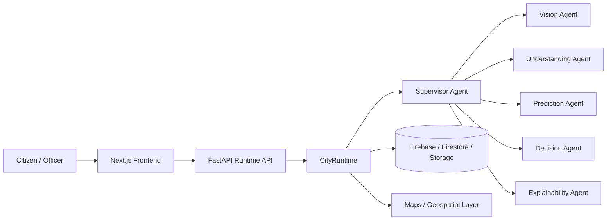
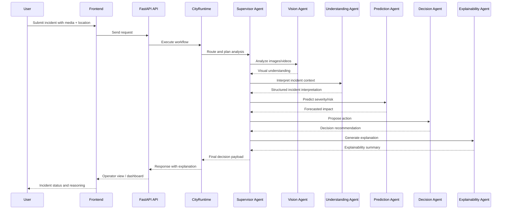
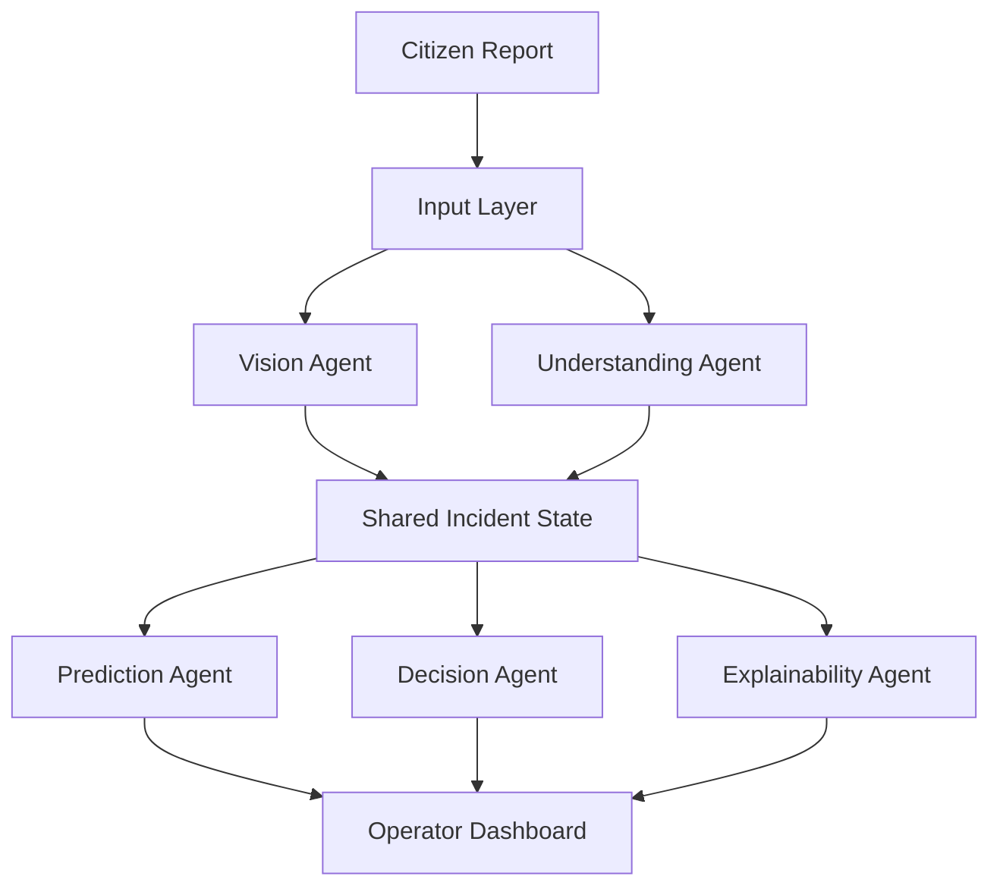
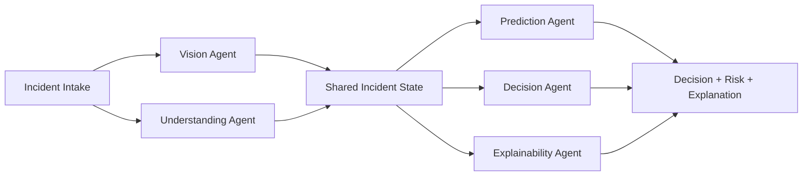

# 🏙️ CityBrain AI
### Explainable Multi-Agent Intelligence for Urban Incident Operations

**Strategic Research Report** — Competitive Landscape · Literature Review · Patent & Novelty Analysis · Roadmap

  

> **Scope.** This report synthesizes public information about major smart-city platforms, relevant research directions, and the current CityBrain AI implementation in this repository. It is intended as hackathon preparation material, technical documentation, and a foundation for future research writing.
>
> **Disclaimer.** The competitor, patent, and feature comparisons below reflect a strategic, publicly-sourced view — not a legal, procurement, or benchmarking review. Ratings are qualitative and directional, not measured against a formal rubric.

---

## Table of Contents

1. [Executive Summary](#executive-summary)
2. [Project Snapshot](#project-snapshot)
3. [Architecture Overview](#architecture-overview)
4. [Section 1 — Competitor Analysis](#section-1--competitor-analysis)
5. [Section 2 — Feature Comparison](#section-2--feature-comparison)
6. [Section 3 — Research Paper Review](#section-3--research-paper-review)
7. [Section 4 — Patent Analysis](#section-4--patent-analysis)
8. [Section 5 — Novelty Analysis](#section-5--novelty-analysis)
9. [Section 6 — SWOT Analysis](#section-6--swot-analysis)
10. [Section 7 — Google AI Agent Builder Series Evaluation](#section-7--google-ai-agent-builder-series-evaluation)
11. [Section 8 — Top 30 Features to Add](#section-8--top-30-features-to-add)
12. [Section 9 — Future Research Directions](#section-9--future-research-directions)
13. [Section 10 — Final Verdict](#section-10--final-verdict)
14. [Appendix — Supplementary Diagrams & Tables](#appendix--supplementary-diagrams--tables)
15. [References](#references)

---

## Executive Summary

CityBrain AI is an AI-powered **Smart City Operations Platform** that unifies citizen incident intake, multimodal input processing, geospatial context, predictive reasoning, explainability, and a multi-agent architecture in a single workflow. Relative to large incumbent platform vendors, its strongest differentiator is bringing citizen-facing intake, operator-facing decision support, and explainable multi-agent reasoning together end-to-end — rather than as separate modules bolted onto a dashboard.

**Current strengths:**

- 🎥 **Multimodal incident reporting** — image, video, audio, GPS, and reverse geocoding
- 🧠 **AI-driven triage** — incident classification, severity estimation, and risk scoring
- 🔍 **Explainability** — operator-facing decision support with visible reasoning
- 🧩 **Modular multi-agent architecture** — built on FastAPI, Python, Firebase, Firestore, and Next.js

**Strategic framing.** CityBrain AI is not "another smart-city dashboard." It functions closer to a *civic operations intelligence layer* — connecting public reporting, AI analysis, and operator decision-making into one traceable pipeline. That positions it well for both hackathon demos and future research publication.

---

## Project Snapshot

| Dimension | Current Position |
|---|---|
| **Platform Type** | AI-powered Smart City Operations Platform |
| **Primary Use Case** | Incident intake, triage, classification, severity prediction, and decision support |
| **Primary Users** | Citizens, field officers, municipal operators, administrators |
| **Backend** | FastAPI, Python, Firebase, Firestore, Firebase Storage |
| **Frontend** | Next.js, React, Tailwind CSS, TypeScript |
| **Core AI Capability** | Vision, understanding, prediction, decision support, explainability |
| **Architectural Style** | Multi-agent workflow with shared incident state |
| **Current Differentiator** | Unified multimodal intake + explainable AI + multi-agent orchestration |

### Current Feature Set

- AI-powered citizen incident reporting
- Image upload · Video upload · Voice recording
- GPS capture · Reverse geocoding · Google Maps integration
- AI vision · Incident classification · Severity prediction · Risk scoring
- Explainability
- Multi-agent architecture

### Agents in the Current System

| # | Agent | Role |
|---|---|---|
| 1 | **Supervisor Agent** | Orchestrates the workflow and routes tasks to specialist agents |
| 2 | **Vision Agent** | Analyzes images and video for visual evidence |
| 3 | **Understanding Agent** | Interprets incident context and structures the report |
| 4 | **Prediction Agent** | Forecasts severity and risk |
| 5 | **Decision Agent** | Recommends an operational action |
| 6 | **Explainability Agent** | Produces a human-readable reasoning summary |

---

## Architecture Overview

### High-Level Architecture

### Multi-Agent Workflow

---

## Section 1 — Competitor Analysis

| Platform | Company | Purpose | Technology | AI Strength | Key Features | Advantages | Limitations | License Model | Innovation |
|---|---|---|---|---|---|---|---|---|---|
| Google | Google | Smart city data, mapping, cloud analytics, AI-driven public-sector solutions | Google Cloud, Maps, Vertex AI, Gemini | Strong | Mapping, analytics, vision, data integration, geospatial intelligence | Excellent geospatial/AI ecosystem; strong developer tooling; scalable cloud foundation | Less vertically focused on municipal operations out of the box; often needs custom integration | Commercial | High |
| Microsoft | Microsoft | City operations, public-sector transformation, Azure-based analytics | Azure, IoT, Power Platform, AI services | Strong | Data integration, IoT, dashboards, low-code tooling, copilots | Strong enterprise integration; strong security/compliance | Municipal workflow depth can be less specialized than domain-native offerings | Commercial | High |
| IBM | IBM | Intelligent operations, urban infrastructure monitoring, decision support | IBM Cloud, Watson, Maximo-style operations, analytics | Strong | Operations center workflows, monitoring, AI-assisted triage | Mature analytics and automation heritage | Often more enterprise-heavy and less citizen-facing than CityBrain AI | Commercial | Medium-High |
| AWS | Amazon | Cloud infrastructure for smart-city applications and analytics workloads | AWS IoT, analytics, storage, ML | Strong | Data ingestion, telemetry, ML, event processing, dashboards | Massive scalability and ecosystem | Requires substantial custom engineering for end-to-end civic workflows | Commercial | Medium-High |
| Oracle | Oracle | Public sector and utilities modernization, digital operations | Oracle Cloud, databases, ERP, analytics | Moderate | Data management, workflow, enterprise platforms | Strong enterprise data stack and public-sector footprint | Less specialized in multimodal incident intelligence | Commercial | Medium |
| Cisco | Cisco | Connected infrastructure, networked operations | Networking, IoT, security, edge systems | Moderate | Connectivity, device management, infrastructure monitoring | Very strong in connected infrastructure resilience | Less focused on AI-driven incident reasoning and citizen reporting | Commercial | Medium |
| Palantir | Palantir | Operational decision support for government and defense | Gotham, Foundry, ontology-driven analytics | Strong | Data fusion, mission operations, cross-agency analytics | Excellent complex data integration | Less consumer-facing; less naturally suited for multimodal intake | Commercial | High |
| Esri | Esri | GIS-led urban planning, asset management, geographic intelligence | ArcGIS, geospatial analytics, location intelligence | Strong | GIS, maps, spatial analytics, asset tracking | Very strong geospatial stack and municipal planning maturity | Less natively AI-agentic for triage and explainability | Commercial | Medium-High |
| Siemens | Siemens | Smart infrastructure, mobility, utilities, city operations | Smart infrastructure, digital twins, automation | Strong | Digital twins, infrastructure monitoring, automation | Strong physical infrastructure and industrial operations | Less focused on citizen-report-driven workflows | Commercial | High |
| Hexagon | Hexagon | Geospatial, asset lifecycle, industrial intelligence | Sensor analytics, GIS, industrial operations | Strong | Geospatial analytics, remote sensing, asset monitoring | Strong spatial and industrial intelligence stack | Less tailored to civic incident reasoning and explainability | Commercial | Medium-High |
| India Smart Cities Mission | Government of India | National urban modernization with integrated command/control centers | Public-sector e-governance systems, ICCC-style deployment | Moderate | Service delivery, civic services, data integration | Strong public-sector relevance and policy alignment | Often fragmented, slower to innovate, less AI-native | Public / Programmatic | Medium |
| ICCC | City/state governments | Centralized urban operations and incident monitoring | Command center software, GIS, CCTV, dashboards | Moderate | Incident monitoring, dispatch, dashboards, coordination | Strong operational relevance | Often siloed and less adaptive to multimodal AI workflows | Public / Programmatic | Medium |
| Open-source platforms | FIWARE and similar | Open, interoperable urban platform foundations | Open APIs, context brokers, IoT, data models | Moderate | Interoperability, sensor integration, extensibility | Good for customization and community innovation | Harder to operationalize at scale without heavy engineering | Open Source / Mixed | Medium |
| **CityBrain AI** | This repository | Unified civic incident intelligence platform with multimodal intake and explainable multi-agent reasoning | FastAPI, Python, Firebase, Next.js, Gemini-compatible AI stack | **Strong** | Incident reporting, AI vision, geospatial context, severity/risk prediction, explainability | Strong end-to-end demo story; AI-native workflow; easier to showcase than many enterprise suites | Needs stronger production hardening, real-world integrations, deployment scale | Prototype / Open-innovation | **High** |

---

## Section 2 — Feature Comparison

| Feature | Google | Microsoft | IBM | Palantir | Esri | ICCC | **CityBrain AI** |
|---|---|---|---|---|---|---|---|
| Citizen incident intake | Partial | Partial | Partial | Partial | Partial | Strong | **Strong** |
| Image analysis | Strong | Strong | Strong | Partial | Partial | Partial | **Strong** |
| Video analysis | Strong | Strong | Partial | Partial | Partial | Partial | **Strong** |
| Voice analysis | Strong | Strong | Partial | Partial | Partial | Partial | **Strong** |
| GPS capture | Strong | Strong | Partial | Partial | Strong | Strong | **Strong** |
| Reverse geocoding | Strong | Strong | Partial | Partial | Strong | Strong | **Strong** |
| Maps integration | Strong | Strong | Partial | Partial | Strong | Strong | **Strong** |
| GIS analytics | Strong | Strong | Partial | Partial | Strong | Strong | Partial |
| Incident classification | Partial | Partial | Strong | Partial | Partial | Strong | **Strong** |
| Severity prediction | Partial | Partial | Partial | Partial | Partial | Partial | **Strong** |
| Risk scoring | Partial | Partial | Partial | Partial | Partial | Partial | **Strong** |
| Explainability | Partial | Partial | Partial | Partial | Partial | Partial | **Strong** |
| Multi-agent orchestration | Limited | Limited | Partial | Partial | Limited | Limited | **Strong** |
| Shared incident state | Limited | Limited | Partial | Partial | Limited | Limited | **Strong** |
| Operator dashboard | Strong | Strong | Strong | Strong | Strong | Strong | **Strong** |
| Citizen-facing workflows | Partial | Partial | Partial | Partial | Partial | Partial | **Strong** |
| Predictive analytics | Strong | Strong | Strong | Strong | Strong | Partial | **Strong** |
| Digital twin integration | Partial | Partial | Strong | Partial | Strong | Partial | Partial |
| Edge AI readiness | Strong | Strong | Partial | Partial | Partial | Partial | Partial |
| Federated learning | Partial | Partial | Partial | Partial | Partial | Limited | Partial |
| Anomaly detection | Strong | Strong | Strong | Strong | Strong | Partial | Partial |
| Cross-agency data fusion | Partial | Strong | Strong | Strong | Partial | Partial | Partial |
| Low-code deployment | Strong | Strong | Partial | Partial | Partial | Partial | Partial |
| Open-source extensibility | Partial | Partial | Partial | Partial | Partial | Partial | Partial |

### Missing or Underdeveloped Features in CityBrain AI

- Deep GIS-native analytics
- Long-term digital twin integration
- Advanced edge AI and federated deployment
- Large-scale cross-agency data federation
- Advanced field operations and dispatch integration
- Enterprise-grade compliance, audit, and role-based governance

---

## Section 3 — Research Paper Review

Summary of major research directions from 2023–2026, emphasizing themes relevant to smart-city AI systems and civic operations.

> **Note.** This section draws on representative 2023–2026 literature themes and public research directions rather than a single proprietary bibliography. The focus is strategic relevance and identifiable research gaps.

| Topic | Research Problem | Methodology | Advantages | Limitations | Research Gap | How CityBrain AI Addresses It |
|---|---|---|---|---|---|---|
| Smart Cities | Fragmented sensing, reactive operations, weak cross-domain decision support | Hybrid sensing, analytics, digital services, city-scale dashboards | Improved visibility and service coordination | Many systems remain siloed and lack explainable AI | Few systems combine multimodal civic intake with operational reasoning in one workflow | Combines citizen input, video/audio/image analysis, geospatial context, and decision support in one platform |
| Critical Infrastructure Monitoring | Failures propagate quickly across utilities, transit, and public services | Sensor fusion, anomaly detection, risk estimation, real-time monitoring | Faster response and better situational awareness | Often hardware/sensor-focused rather than human-centric interpretation | Limited systems connect infrastructure data to citizen-reported incidents | Bridges citizen reports with operator triage and severity prediction |
| AI Monitoring & Anomaly Detection | High-volume events are difficult to monitor manually | ML, forecasting, graph analytics, anomaly scoring | Better early warning and prioritization | Results often lack transparency and trust | Most anomaly systems don't explain why an alert matters operationally | Explicitly includes explainability and structured reasoning outputs |
| Incident Analysis | Incident management remains reactive, lacking structured evidence-based triage | NLP, computer vision, geospatial context, risk scoring | Better prioritization and evidence quality | Often treated as a single-model task rather than a workflow | Gap for multi-step reasoning over structured and multimodal evidence | Multi-agent pipeline: vision, understanding, prediction, decision, explanation |
| Digital Twins | Operators need better virtual representation of infrastructure/services | Digital twins, simulation, sensors, urban modeling | Strong planning and scenario analysis | Expensive and often decoupled from citizen operations | Few digital twins integrate with real-time civic incident intake | Can evolve into a lightweight operational digital twin for incident intelligence |
| Predictive Analytics | Cities need to anticipate risk and resource utilization | Forecasting, historical patterns, geospatial clustering, classification | Proactive intervention and better allocation | Quality depends heavily on data quality and governance | Rarely paired with explainable operational recommendations | Connects prediction with actionable decision support and explanation |
| Edge AI | Bandwidth, latency, and privacy constraints matter for many deployments | On-device inference, local models, hybrid edge-cloud pipelines | Lower latency and better privacy | Deployment complexity and model maintenance are substantial | Underexplored in citizen-report-driven civic systems | Can add edge collection and local preprocessing for field officers and sensors |
| Federated Learning | Data sharing across agencies is constrained by privacy and governance | Federated model training across districts, agencies, devices | Privacy-preserving coordination and shared learning | Coordination and heterogeneity remain difficult | Rarely applied to civic multi-agency incident intelligence | Creates a natural path for federated learning research in future versions |
| Explainable AI | Operators need transparent, audit-friendly reasoning | SHAP-style explanations, rule-based reasoning, counterfactuals, reasoning traces | Higher trust and easier adoption | Explanations may be shallow or untailored to operator workflows | Many civic systems still lack stakeholder-readable explanations | Includes a dedicated explainability agent and reasoning outputs |
| Multi-Agent Systems | Complex tasks need specialized reasoning rather than one monolithic model | Agent orchestration, tool use, role-based planning, shared state | Better task decomposition and modularity | Can become fragile without strong orchestration and memory | Room for robust, shared-state civic agent architectures | Shared-state multi-agent architecture directly addresses this gap |

### Research Gaps Summary

1. Multimodal civic intelligence combining media, geospatial data, and operational context
2. Explainable decision support for public-sector operators
3. Shared-state multi-agent orchestration for urban incident workflows
4. Privacy-aware collaboration across agencies and edge devices
5. Transition from pilot/demo systems to robust public-sector deployment

---

## Section 4 — Patent Analysis

> Strategic landscape review of public patent families and related innovation areas. **Not legal advice.**

| Patent / Family Area | Representative Owners | Summary | Overlap | Risk | How CityBrain AI Differs | Recommendation |
|---|---|---|---|---|---|---|
| Urban operations & command-center software | IBM, Siemens, Cisco, Oracle, and others | Systems for centralized city operations, dispatch, and incident coordination | High | Medium-High | More AI-centric and citizen-facing rather than purely command-center control | Emphasize multimodal AI and explainability as core differentiators |
| Computer vision for public safety/incident detection | Google, NEC, Hitachi, and others | Vision systems identifying hazards, incidents, or anomalies | Medium | Medium | Treats vision as one agent within a broader reasoning workflow | Position as a reasoning platform, not only a vision system |
| Geospatial risk analysis & anomaly detection | Esri, Hexagon, Siemens, and others | Spatial models for hazard analysis and geospatial risk | Medium | Medium | Adds incident reasoning and explainability beyond geospatial analytics alone | Highlight geospatial reasoning plus incident triage and operator guidance |
| AI-assisted operations & workflow orchestration | IBM, Microsoft, and others | AI-guided workflows for operations centers and enterprise tasks | Medium | Medium | Explicitly uses a multi-agent civic workflow | Protect the architecture, shared-state design, and explainability layer |
| Explainable decision-support systems | Multiple AI vendors and research labs | Transparent AI systems for audit and trust | Medium | Medium | Makes explanations operationally accessible to municipal staff | Publish transparent explanation and evaluation methods |

### Patent Risk Assessment

Overall patent risk is **moderate, not prohibitive**. The key risk is not the general idea of a "smart city platform," but the *specific combination* of:

- Multimodal civic intake
- Geospatial incident reasoning
- Predictive triage and risk estimation
- Explainable decision support

CityBrain AI should avoid over-claiming exclusivity over basic GIS or general AI systems. The defensible story is the **unique integration and workflow design**, not any single component.

---

## Section 5 — Novelty Analysis

### Existing Concepts

Most individual components already exist in some form:

- Incident reporting systems
- GIS and mapping platforms
- AI vision systems
- Predictive analytics tools
- Explainable AI methods
- Multi-agent orchestration frameworks

### Novel Integration

The novelty is not any single feature — it's the combination of several into one civic operations workflow:

1. Citizen multimodal reporting
2. Computer vision and audio understanding
3. Geospatial and reverse-geocoding context
4. Predictive severity and risk estimation
5. Multi-agent orchestration over shared incident state
6. Explainability for municipal operators

### Unique Workflow

**Intake → Analyze → Interpret → Predict → Decide → Explain**

This is stronger than a typical "upload and classify" approach because it creates an inspectable, improvable reasoning chain.

### Research Contribution

CityBrain AI can be framed as a research contribution via:

- A shared-state architecture for multi-agent civic incident intelligence
- An explainable AI workflow for public-sector incident triage
- A multimodal incident intelligence pipeline for cities
- A prototype for AI-mediated urban operational resilience

### Overall Novelty Score

| Dimension | Score (1–10) | Reasoning |
|---|---:|---|
| Existing concepts | 8/10 | Most building blocks are already known |
| Novel integration | 9/10 | The combination is stronger than common point solutions |
| Unique workflow | 8/10 | The agent-based reasoning flow is more distinctive than simple dashboards |
| Research contribution | 8/10 | Supports a strong research narrative |
| **Overall novelty** | **8.3/10** | High novelty in integration and workflow design; moderate novelty in elementary components |

**Interpretation:** CityBrain AI is not "inventing AI" from scratch — it's a compelling, research-relevant synthesis of known methods into a practical civic operations platform.

---

## Section 6 — SWOT Analysis

| Category | Assessment |
|---|---|
| **Strengths** | Strong end-to-end demo story; multimodal intake; explainability; multi-agent design; clear public-sector relevance |
| **Weaknesses** | Needs stronger production hardening, integration depth, deployment readiness, governance, and scale |
| **Opportunities** | Public-sector pilots, emergency operations, municipal service optimization, climate resilience, digital twins, edge AI, federated learning |
| **Threats** | Competition from large vendors; regulatory and privacy concerns; difficulty transitioning from prototype to operational deployment |

**Strategic implication:** CityBrain AI is well-positioned as a high-clarity prototype that can evolve into a serious civic AI product if it adds real-world integrations and stronger deployment maturity.

---

## Section 7 — Google AI Agent Builder Series Evaluation

Evaluated as if being considered for a Google AI Agent Builder–style showcase. Scoring is relative and qualitative rather than a formal benchmark.

| Criterion | Score (1–10) | Explanation |
|---|---:|---|
| Innovation | 8/10 | The multi-agent + explainable operations flow is innovative and easier to explain than a generic chatbot |
| Technical Complexity | 8/10 | Fairly sophisticated architecture, especially for a hackathon prototype |
| AI Usage | 9/10 | Vision, prediction, context reasoning, and explainability show strong AI depth |
| Gemini Integration | 8/10 | Well aligned with Gemini-style multimodal and reasoning workflows |
| Scalability | 7/10 | Expandable architecture, but production scaling still needs work |
| Real-World Impact | 8/10 | Highly relevant, practical use case for city operations |
| UI | 8/10 | Strong operator-story narrative and polished UX potential |
| Presentation | 8/10 | Compelling demo story: citizen report → AI analysis → operator decision support |
| Demo | 8/10 | Visually understandable and easy to present to non-technical judges |
| **Overall** | **8.2/10** | A strong hackathon and research story with clear further potential |

### Suggested Improvements

1. Add a live multimodal demo path with real media ingestion and streamed analysis
2. Show a decision trace in the UI: evidence → prediction → explanation → action recommendation
3. Add a "why this matters" layer for city officials and judges
4. Introduce a digital twin or map-based simulation mode
5. Demonstrate agent collaboration visibly in the interface
6. Show privacy, safety, and governance handling as part of the experience

---

## Section 8 — Top 30 Features to Add

Prioritized for practical value, aligned with current research trends and platform capabilities.

<strong>Click to expand the full list of 30 features</strong>

1. Multi-language incident intake
2. Automated incident summarization for operators
3. Live map-based incident clustering
4. Priority heatmaps by district or ward
5. Geo-fenced escalation rules
6. Voice-to-incident transcription and entity extraction
7. Image-based hazard detection (flooding, debris, blocked roads, fire signs)
8. Video clip summarization for rapid triage
9. Real-time anomaly alerts for repeated incidents
10. Historical pattern analysis and seasonality trends
11. Resource allocation recommendations
12. Dispatch recommendation engine
13. Integration with municipal service tickets
14. Integration with CCTV or IoT feeds
15. Incident trend forecasting by neighborhood
16. Agent-to-agent evidence handoff
17. Human-in-the-loop review for critical decisions
18. Confidence calibration for predictions
19. Counterfactual explanation mode
20. Bias and fairness monitoring for risk scoring
21. Privacy-preserving local preprocessing on edge devices
22. Federated learning pilots across departments or districts
23. Digital twin-style simulation for scenario planning
24. Interactive 3D or map-based operational view
25. Voice assistant for field officers
26. Multilingual voice assistant support
27. Automated incident escalation to relevant departments
28. Real-time dashboard for public safety and utility incidents
29. Semantic search across historical incident records
30. Explainable audit trail for every recommendation

### Feature Priority Matrix

| Priority | Feature | Impact | Complexity | Recommendation |
|---|---|---|---|---|
| P1 | Incident summarization | High | Low | Implement first |
| P1 | Resource recommendation | High | Medium | Implement first |
| P1 | Map-based clustering | High | Medium | Implement first |
| P2 | Voice-to-text and transcription | High | Medium | Next |
| P2 | CCTV/IoT integration | High | Medium-High | Next |
| P2 | Human-in-the-loop review | High | Medium | Next |
| P3 | Federated learning pilot | Medium | High | Later |
| P3 | Digital twin simulation | Medium | High | Later |
| P3 | 3D operational view | Medium | High | Later |

---

## Section 9 — Future Research Directions

- Multi-agent urban resilience modeling
- Explainable public-sector AI evaluation
- Federated civic intelligence
- Digital twin integration for operations centers
- Human-centered design for public-sector decision support

---

## Section 10 — Final Verdict

**Does this project already exist?**
Yes, in the sense that many components already exist in commercial platforms, public-sector programs, and research systems. What's less common is the specific combination of multimodal civic intake, agent-based reasoning, explainability, and a compact modern demo architecture in one platform.

**What makes CityBrain AI unique?**
- Citizen-facing incident intake
- Multimodal AI reasoning
- Geospatial awareness
- Explainable operator support
- Shared-state multi-agent orchestration

**What features are common across the market?**
- Incident dashboards
- GIS mapping
- Analytics and reporting
- Some form of AI classification or anomaly detection
- Operator workflows

**What features are innovative?**
- Explainable multi-agent reasoning for civic incidents
- Integrated multimodal evidence processing
- Shared-state orchestration for decision support
- A strong demo narrative around urban intelligence

**What would impress judges?**
- The end-to-end flow from citizen report → AI analysis → operator recommendation
- The explainability layer
- The visually understandable multi-agent workflow
- Relevance to real municipal operations

**Would this be publishable as research?**
Yes — especially framed as:
- A shared-state multi-agent architecture for civic incident intelligence
- An explainable AI workflow for public-sector operations
- A multimodal urban resilience platform

The strongest publication angle isn't "AI for smart cities" generically, but **"an explainable multi-agent framework for multimodal urban incident intelligence."**

**Would this be competitive in hackathons?**
Yes — it has a clear user story, a meaningful problem, a compelling technical architecture, strong visual explainability, and a realistic public-sector narrative.

**How could it become one of the strongest Smart City AI platforms?**

1. Stronger production readiness and deployment design
2. Better integrations with real municipal systems
3. More sophisticated explainability and auditability
4. A clear research and commercialization narrative

---

## Appendix — Supplementary Diagrams & Tables

### A. Architecture Diagram

### B. Multi-Agent Workflow Diagram

### C. Research Gap Table

| Gap | Why It Matters | Current State | CityBrain AI Opportunity |
|---|---|---|---|
| Multimodal civic reasoning | Urban incidents are rarely single-channel | Many systems focus on one mode | Strong opportunity |
| Explainable public operations | Operators need trustworthy reasoning | Explanations are often weak or absent | Strong opportunity |
| Shared-state agent coordination | Complex workflows need persistent context | Agent systems are often fragmented | Strong opportunity |
| Privacy-aware collaboration | Cross-agency sharing is difficult | Limited practical research | High opportunity |
| Operational digital twins | Simulation helps with planning | Often disconnected from live operations | Medium-High opportunity |

### D. Competitor Matrix

| Competitor | Best At | Weakest Link | CityBrain AI Advantage |
|---|---|---|---|
| Google | Geospatial intelligence and AI ecosystem | Less municipal workflow depth | Stronger civic workflow narrative |
| Microsoft | Enterprise integration and low-code productivity | Less domain-specific civic reasoning | Stronger AI-agent workflow story |
| IBM | Enterprise operations and analytics | Heavier and less citizen-facing | More intuitive end-to-end demo |
| Palantir | Data fusion and operational analysis | Less consumer-facing and less multimodal | Better multimodal civic experience |
| Esri | GIS and location intelligence | Less AI-agentic triage | Stronger explainable incident reasoning |
| ICCC | Municipal operations | Often siloed and less AI-native | More AI-native and modular |

### E. Innovation Heatmap

| Dimension | CityBrain AI | Google | Microsoft | IBM | Palantir | Esri |
|---|---|---|---|---|---|---|
| Multimodal intake | High | High | High | Medium | Low | Low |
| Explainability | High | Medium | Medium | Medium | Medium | Low |
| Multi-agent workflow | High | Low | Low | Medium | Medium | Low |
| Citizen-facing UX | High | Medium | Medium | Low | Low | Low |
| Geospatial intelligence | Medium | High | High | Medium | Medium | High |
| Operational depth | Medium | Medium | High | High | High | Medium |

### F. Patent Risk Matrix

| Risk Area | Likelihood | Impact | Mitigation |
|---|---|---|---|
| General smart-city platform concept | High | Medium | Focus on workflow and integration rather than the generic concept |
| Computer vision for incident detection | Medium | Medium | Emphasize reasoning and multi-agent workflow |
| Explainable operations | Medium | Medium | Publish transparent methods and evaluations |
| Geospatial analytics | Medium | Medium | Position as a civic intelligence layer, not just GIS |

### G. Suggested Research Paper Titles

1. Explainable Multi-Agent Intelligence for Urban Incident Triage
2. A Shared-State Architecture for Multimodal Civic Operations AI
3. From Citizen Reports to Operator Decisions: An Explainable Smart City Workflow
4. Urban Incident Intelligence with Vision, Language, and Geospatial Reasoning
5. Privacy-Aware Civic AI: Edge and Federated Approaches for Smart Cities
6. AI-Augmented Municipal Decision Support for Resilience and Risk Management
7. Multimodal Urban Incident Analysis Using Agent-Based Reasoning Systems
8. Designing Trustworthy Smart City AI for Public Operations
9. A Digital-Twin-Inspired Framework for Civic Incident Intelligence
10. Human-Centered Explainable AI for Emergency and Service Operations

### H. Suggested Future Publications

1. A conference paper on the shared-state multi-agent architecture for civic incident management
2. A journal article on explainable AI for public-sector incident triage
3. A technical report on multimodal civic operations intelligence
4. A case study of CityBrain AI as a hackathon-to-product transition story
5. A white paper on the future of AI-enabled municipal command centers

---

## References

Public, high-level reference sources used to validate the strategic comparisons above — cited for context, not as legal or technical guarantees.

1. [Google Cloud Smart Cities](https://cloud.google.com/solutions/smart-cities)
2. [Microsoft for Cities and Municipalities](https://www.microsoft.com/en-us/industry/municipalities)
3. [IBM Intelligent Operations Center](https://www.ibm.com/products/intelligent-operations-center)
4. [AWS Smart Cities Solutions](https://aws.amazon.com/solutions/implementations/smart-cities/)
5. [Oracle Smart Cities](https://www.oracle.com/industries/smart-cities/)
6. [Cisco Smart+Connected Communities](https://www.cisco.com/c/en/us/solutions/industries/smart-connected-communities.html)
7. [Palantir for Government and Defense](https://www.palantir.com/platforms/gotham/)
8. [Esri Smart Cities](https://www.esri.com/en-us/industries/smart-cities/overview)
9. [Siemens Smart Infrastructure](https://www.siemens.com/global/en/products/industry/smart-infrastructure.html)
10. [Hexagon Smart Cities](https://hexagon.com/industries/smart-cities)
11. [India Smart Cities Mission](https://smartcities.gov.in/)
12. [arXiv — Smart City & AI research](https://arxiv.org/)
13. [IEEE Xplore — Smart Cities and AI topics](https://ieeexplore.ieee.org/)
14. [Nature Research](https://www.nature.com/) and [Springer — Urban Computing Literature](https://link.springer.com/)
15. [FIWARE Open-Source Smart City Ecosystem](https://www.fiware.org/)

---

### Final Takeaway

CityBrain AI is not just another civic app — it's a strong candidate for a next-generation, AI-native public operations platform because it places multimodal sensing, predictive reasoning, and explainability into a single workflow. Its strongest narrative isn't replicating every commercial platform feature, but delivering a **focused, understandable AI operations story** for cities, operators, and judges.

With stronger deployment readiness, deeper integration depth, and more explicit research framing, CityBrain AI could become one of the most compelling hackathon-ready Smart City AI platforms in its class.

